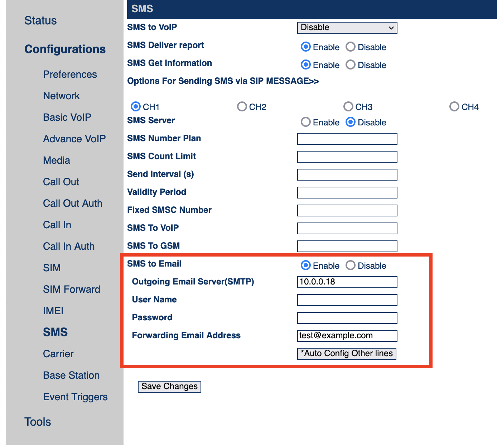

# goip-sms-to-telegram
 This is quickly made proof of concept of dead-simple smtp-powered goip to telegram sms forwarder.

 The simplest way to process incoming sms messages from GoIP is to use built-in sms to email feature. Other ways like SMPP, SIP MESSAGE and admin page parsing are inconvenient and overcomplicated. So this script runs a simple unauthenticated smtp server that receives and parses goip email messages then forwards it to telegram.

 ## Limitations
 Due to poor engineering GoIP gateways can reach smtp server only by port 25. Port number following colon in smtp server address doesn't work at all.
 
 Please note that I have GoIP4 with firmware version ```GST1610-1.01-70```. Other hardware/firmware versions wasn't tested.

 ## Usage
 1. Install ```aiosmtpd``` and ```python-telegram-bot``` dependencies like this:
   ```
   pip3 install aiosmtpd python-telegram-bot
   ```
 2. Replace ```your_tg_bot_token_here``` and ```your_chat_id_here``` with your bot token and chat_id
 3. Run ```./goip_to_tg.py``` from root (because you need to bind TCP/25)
 4. Set up every goip channel like this (replace 10.0.0.18 with your address, forwarding email can be anything):
 

 ## Everything else
 Feel free to open an issue if you need any help. Star and follow are appreciated 😉
